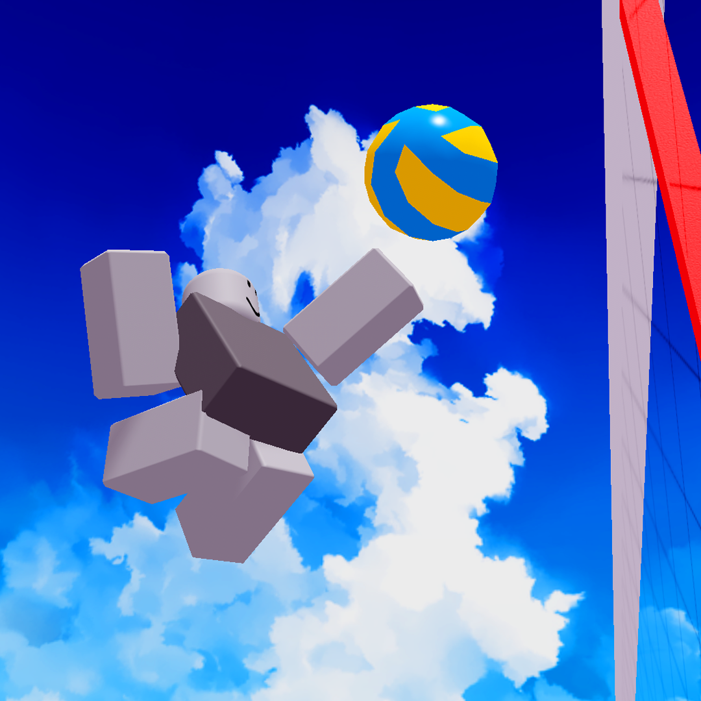

  <h3>welcome to my github page</h3>

|number lore|T___T 🐔|best reachable via twitter!|
|:-:|:-:|:-|
|&nbsp;〇&nbsp;八&nbsp;二&nbsp;六 00&nbsp;&nbsp;8&nbsp;&nbsp;&nbsp;2&nbsp;&nbsp;6  &nbsp;o ba fu ro  overflowed||[Github](https://github.com/00826) [Twitter](https://twitter.com/ovarflowed) [Youtube](https://www.youtube.com/@ovarflowed) [Roblox](https://www.roblox.com/users/24103210/profile)|

## table of utils:

|thing|what it does|
|-|-|
|[/castable](https://github.com/00826/castable) (December 2024)|no-network-roundtrip skill casting|
|[/questmodule](https://github.com/00826/questmodule) (November 2024)|linear, multi-step quest controller|
|[/konbini](https://github.com/00826/konbini) (July 2024)|a shelf of roblox-luau convenience modules|
|[/geis-rbx](https://github.com/00826/geis-rbx) (May 2024)|$5 function timer = extortion|

## gallery of works:

### Classy Climbing [(🔗)](https://www.roblox.com/games/91541928958042/)
||
 **Duo developers** <i>(August 2025)</i>   *a two-week-ish, duo-developer, one-button-game-gamejam*
|
|-|-|

#### Software used

- Adobe CC (Photoshop)
- Blender

#### Flowers given

- `A Climbing Game` by TheBigC10
- `Moon Animator` by six
- `White Knuckle` by Dark Machine Games

##### *Classy Climbing* was a broad swing at duo development, and a lot was learned!

---

### fruit 2 [(🔗)](https://www.roblox.com/games/111740486589224/)
||
 **Solo developer** <i>(June 2025)</i>   *a battleground in 2025 that doesn't use hitstuns (shocker)*
|
|-|-|

#### Software used

- Adobe CC (Audition, Illustrator, Photoshop, Premiere Pro)
- Blender

#### Flowers given

- `evaera.vscode-rojo` by evaera
- `JohnnyMorganz.luau-lsp` by JohnnyMorganz
- `Moon Animator` by six
- `One Piece : Name 2` by FroZenFuRyX

##### *fruit 2* ran it back to the mid-late 2010's with old school combat and visuals.

---

### sixes [(🔗)](https://www.roblox.com/games/17845248839/)
||
 **Solo developer** <i>(June 2024)</i>   *a quick volleyball game made in about a month and some change ball sfx was recorded from a slightly-deflated Molten volleyball*
|
|-|-|

#### Software used

- Adobe CC (Illustrator, Photoshop, Premiere Pro)
- Blender

#### Flowers given

- `evaera.vscode-rojo` by evaera
- `JohnnyMorganz.luau-lsp` by JohnnyMorganz
- `Moon Animator` by six

##### *sixes* served as a test to see what could reasonably be done by applying loose time constraints.

---

### Smash Legends X [(🔗)](https://www.roblox.com/games/11586481578/)

||
 **Solo developer** <i>(November 2022)</i>   *because of the strong foundation i built with Smash Legends, i made really big improvements across all facets of game development*
|
|-|-|

#### Software used

- Adobe CC (Illustrator, Photoshop)
- Blender

#### Flowers given

- `evaera.vscode-rojo` by evaera
- `Nightrains.robloxlsp` by Nightrains
- `Moon Animator` by six

##### *Smash Legends X (stylized as SLX)* is the successor to *Smash Legends* with a fully reworked codebase and greatly improved gameplay, visuals, and overall design.

---

### Smash Legends [(🔗)](https://www.roblox.com/games/5630129588/)

||
 **Solo developer** <i>(October 2020)</i>   *my first roblox game evar* *had a lot of fun learning Lua, Blender, and Adobe Illustrator/Photoshop*
|
|-|-|

#### Software used

- Adobe CS 2020 (Illustrator, Photoshop)
- Blender

##### *Smash Legends* began as a learning project, but became a fully fleshed-out game as I became more familiar with the Roblox Game API and more proficient in Lua.

---