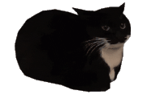

### 
 00826.github.io 

#### 
 born to :3 forced to :<zero-width space>)

|number lore|cat|links|
|:-:|:-:|:-|
|&nbsp;〇&nbsp;八&nbsp;二&nbsp;六 00&nbsp;&nbsp;8&nbsp;&nbsp;&nbsp;2&nbsp;&nbsp;6  &nbsp;o ba fu ro  overflowed||[Linktree](https://linktr.ee/ovar) <i>(full list of links here)</i> [Github](https://github.com/00826) [Twitter](https://twitter.com/ovarflowed)<i> (Best reachable via Twitter!)</i> [Youtube](https://www.youtube.com/@ovarflowed) [Roblox](https://www.roblox.com/users/24103210/profile)|

## List of works:

### Smash Legends X [(Link)](https://www.roblox.com/games/11586481578/)

#### Solo full-stack developer <i>(November 2022 - )</i>

- Solo-developed game (Lua, json)
- Managed workflow with Github, Visual Studio Code, Rojo

#### Software used:

- Visual Studio Code
- Github/Github Desktop
- Adobe Illustrator CC
- Adobe Photoshop CC
- Blender
- Roblox Studio

##### *Smash Legends X (stylized: SLX)* is the successor to *Smash Legends* with a fully reworked codebase and greatly improved gameplay, visuals, and overall design.

---

### Smash Legends [(Link)](https://www.roblox.com/games/5630129588/)

#### Solo full-stack developer <i>(October 2020 - May 2021)</i>

- Solo-developed game (Lua)
- Managed workflow with Roblox Studio

#### Software used:

- Adobe Illustrator CC
- Adobe Photoshop CC
- Blender
- Roblox Studio

##### *Smash Legends* began as a learning project, but became a fully fleshed-out game as I became more familiar with the Roblox Game API and more proficient in Lua.

---